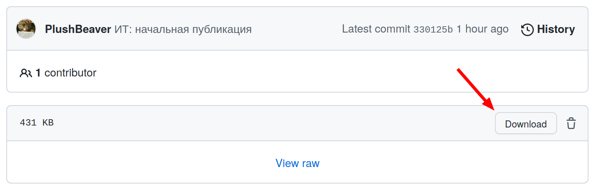

# Учебные материалы кафедры УиТ

## Дисциплины

* [Информационные технологии](courses/it)

## Студентам

* **Вопрос.**
    Я хотел скачать файл, а вместо этого GitHub показывает его текст
    или вместо текста показывает «View Raw».

    **Ответ.** На открывшейся странице нужно нажать на кнопку:

    

## Лицензия

Если явно не указано иное,
материалы под [CC BY-SA 4.0](https://creativecommons.org/licenses/by-sa/4.0/)
(свободное использование с указанием автора, производные под той же лицензией).
